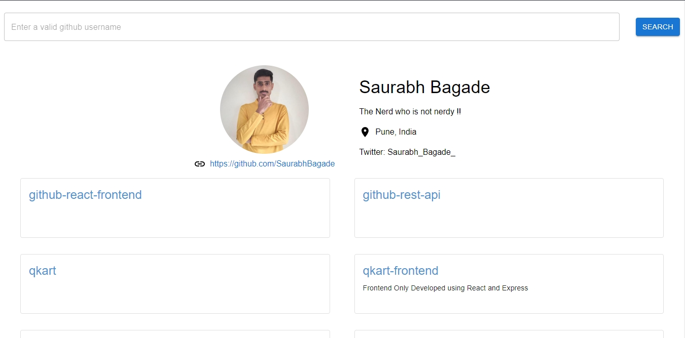

# **Github User And Repositories Listing - Frontend**

ReactJS based Frontend that fetches data from a custom REST API Backend. Performs search according to the username and also lists all public repos with pagination.


## **Features**

- Public (non-authenticated) users can access the Website.
- Uses the free tier limit of Github REST API which resets on a hourly basis.


## **Run Locally**

Clone the project

```bash
  git clone https://github.com/SaurabhBagade/github-react-frontend.git
```

Go to the project directory

```bash
  cd github-react-frontend
```

Install dependencies

```bash
  npm install
```

Start the server

```bash
  npm run dev
```

Build the project

```bash
  npm run build
```


## **Usage**
 

- Run npm start to start the application.
- The website will run on port 5173.


## **Screenshots**
### [🔗**Live**](https://via.placeholder.com/468x300?text=App+Screenshot+Here)




## **Tech Stack**

- [NodeJS](https://nodejs.org/) This is a cross-platform runtime environment built on Chrome's V8 JavaScript engine used in running JavaScript codes on the server. It allows for installation and managing of dependencies and communication with databases.
- [ReactJS](https://reactjs.org/) a popular NodeJS Frontend Framework.


## **Authors**

- [@SaurabhBagade](https://github.com/SaurabhBagade)


## **License**

This project is available for use under the [MIT](https://choosealicense.com/licenses/mit/) License.

